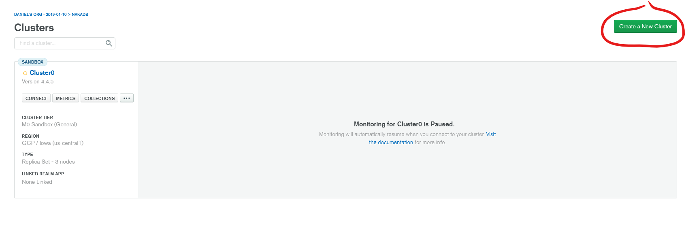
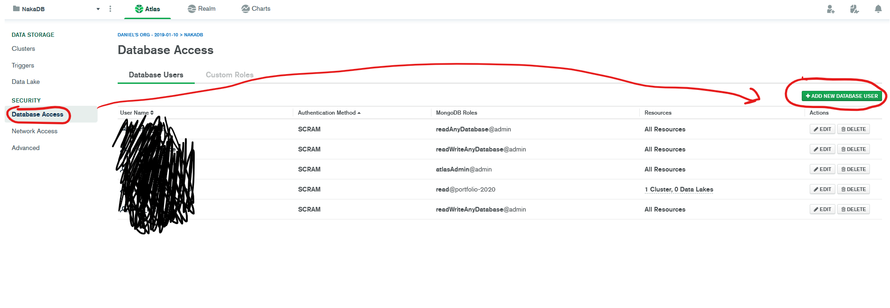
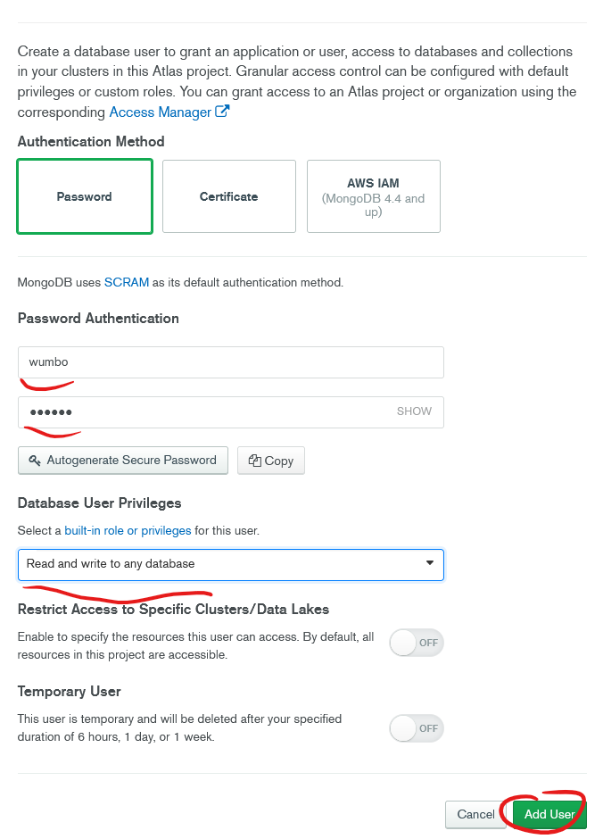
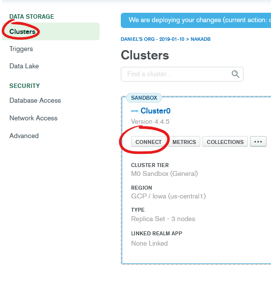
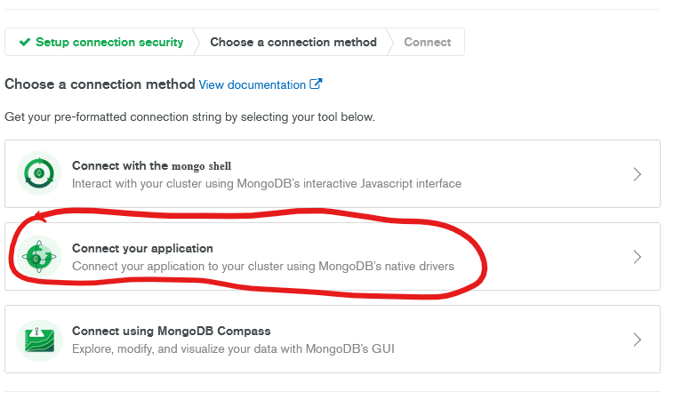
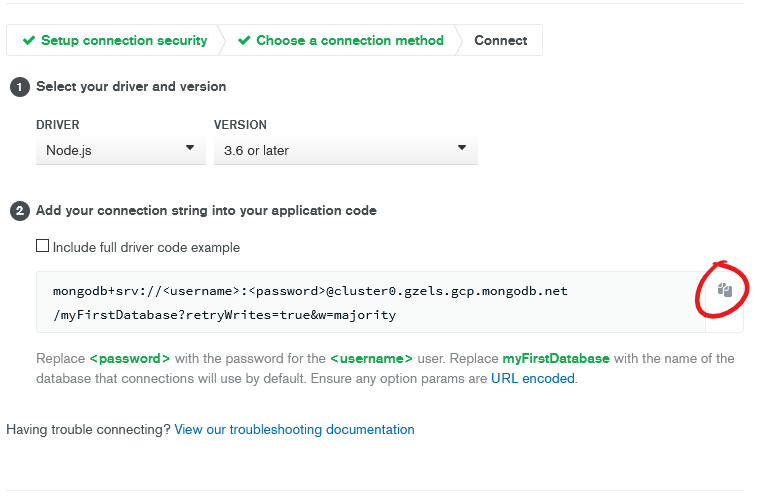

# Mongo atlas tutorial
The purpose of this tutorial is for you to leave with a proper mongo access url

## Create a mongo atlas account

## Create a new cluster

## Add a new user
Once you're done creating a new cluster, navigate to the database access tab and create a new user

## User setup
Use the password method. Create a username and password for your user and give them read and write access

## Connect to your cluster
Navigate to the clusters tab press connect on the cluster you created. Follow the images to get your mongo atlas connection link and put that into the env.

Make sure you change "myFirstDatabase" to the name of your database.

